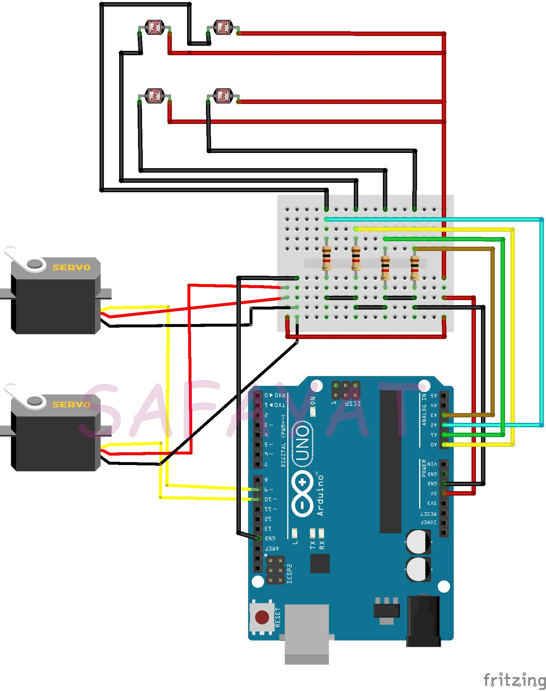

# solar-tracker
# Introduction :
A solar tracker is a mechanical-automatic device that through sensors can understand the position of the Sun. 
# Apparatus : 
* Arduino Uno
* Servo Moto
* Solar Panel
* LDR
* Resistors
* Jumper Wires
# Schematics : 

# Code : 
[Code Link](Solar_Tracker.ino)
# Working Principle : 
LDRs are used as the main light sensors. Two servo motors are fixed to the structure that holds the solar panel. LDRs sense the amount of sunlight falling on them. Four LDRs are divided into top, bottom, left and right. For east – west tracking, the analog values from two top LDRs and two bottom LDRs are compared and if the top set of LDRs receive more light, the vertical servo will move in that direction.If the bottom LDRs receive more light, the servo moves in that direction. For angular deflection of the solar panel, the analog values from two left LDRs and two right LDRs are compared. If the left set of LDRs receive more light than the right set, the horizontal servo will move in that direction. If the right set of LDRs receive more light, the servo moves in that direction.
# Application : 
* This structure can increase the efficiency of a Solar Panel by tracking Sun.
